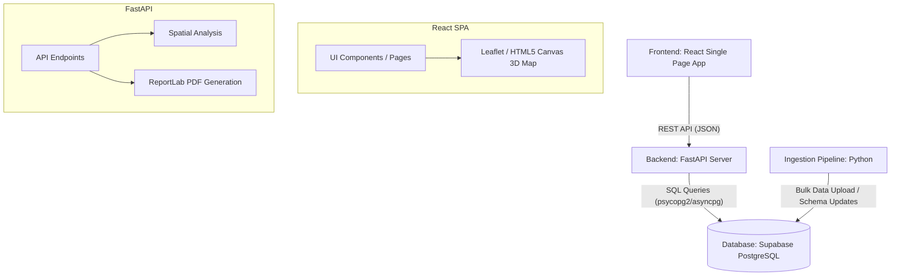
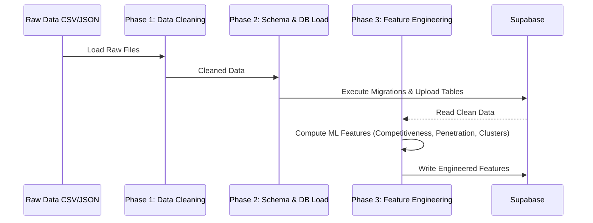

# BoothIQ

BoothIQ is a strategic campaign intelligence platform that provides constituency-level analytics, demographic profiling, and machine-learning-driven voter segmentation for electoral campaigns. 

It provides spatial visualizations, predictive modeling, and robust data management in a unified interface designed to streamline intelligence-gathering and campaign strategy.

---

## 🎯 What It Does

BoothIQ empowers campaigns by bridging the gap between raw data and actionable strategy:
- **Spatial Intelligence**: Provides immersive 2D maps and 3D holographic projections of constituencies to visualize metrics like voter turnout and margins.
- **Voter Segmentation & Targeting**: Uses machine learning to cluster constituencies and identify key demographic trends.
- **Performance Tracking**: Analyzes anti-incumbency, competitiveness, and historical election results to pinpoint battleground areas.
- **Reporting**: Generates on-the-fly PDF reports for field agents and strategists detailing actionable constituency insights.

## ⚙️ How It Works

1. **Data Ingestion**: Raw demographic data, historical election results, and geographic boundaries are ingested, cleaned, and merged into a unified dataset.
2. **Feature Engineering**: Advanced metrics such as 'Competitiveness Score', 'Scheme Penetration Score', and 'Anti-Incumbency Magnitude' are calculated using Python data science libraries.
3. **API Layer**: A high-performance FastAPI backend serves this engineered data through RESTful endpoints.
4. **Interactive Visualization**: The React frontend queries the backend to render dynamic maps. Users can toggle between traditional 2D choropleth maps and 3D isometric projections to visually explore multi-dimensional data like winning margins layered over voter turnout.

---

## 🏛 Architecture Overview

BoothIQ follows a modern, decoupled client-server architecture:



## 🗂 Project Structure

The repository is modularized into three main applications:

- **`backend/`**: A high-performance Python FastAPI server providing data endpoints, on-the-fly PDF report generation, and complex spatial queries.
- **`frontend/`**: A React single-page application built with Vite and TypeScript for interactive 2D maps and 3D holographic visualizations.
- **`ingestion/`**: A collection of Python scripts for raw data ingestion, data cleaning, advanced feature engineering (e.g., scheme penetration score), and database population.

## 🔄 Data Ingestion Flow

The ingestion pipeline handles transforming raw data into actionable ML features and loading it into the Supabase database.



## 🛠 Tech Stack

- **Database**: Supabase (PostgreSQL)
- **Backend**: FastAPI, Uvicorn, Python, ReportLab (PDF generation)
- **Frontend**: React, Vite, TypeScript, TailwindCSS, Leaflet (2D map), HTML5 Canvas (3D hologram projection)
- **Data Engineering**: Pandas, NumPy, Scikit-learn

## 🚀 Setup and Installation

### Backend Setup
1. Navigate to the backend folder:
   ```bash
   cd backend
   ```
2. Install the dependencies:
   ```bash
   pip install -r requirements.txt
   ```
3. Configure environment variables in an `.env` file or `ingestion/.env`:
   - `SUPABASE_URL`
   - `SUPABASE_KEY`
4. Run the FastAPI development server:
   ```bash
   uvicorn app.main:app --reload --host 127.0.0.1 --port 8000
   ```

### Frontend Setup
1. Navigate to the frontend folder:
   ```bash
   cd frontend
   ```
2. Install the node modules:
   ```bash
   npm install
   ```
3. Configure API endpoints in `.env.local`:
   ```env
   VITE_API_BASE_URL=http://localhost:8000
   ```
4. Start the frontend development server:
   ```bash
   npm run dev
   ```

## 🌐 Deployment

- **Backend**: Deployed on **Render** using the `render.yaml` blueprint definition for containerized or native Python deployment.
- **Frontend**: Deployed on **Vercel** for fast static and edge-network delivery.
- **Database**: Hosted on **Supabase** Cloud PostgreSQL.
